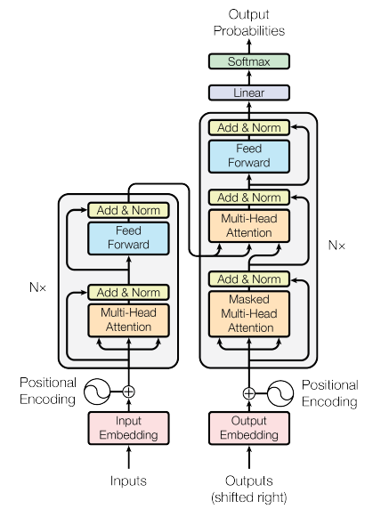

# Transformer from Scratch
This project implements a Transformer model from scratch, based on the "Attention Is All You Need" paper. The current use case is an English to Italian translator, but it can be easily adapted to other language pairs through the configuration file.

## Table of Contents

- [Overview](#overview)
- [Features](#features)
- [Project Structure](#project-structure)
- [Getting Started](#getting-started)
- [Usage](#usage)
- [Configuration](#configuration)
- [Next Steps](#next-steps)
- [Contributing](#contributing)
- [License](#license)

## Overview

This project aims to provide a deep understanding of Transformer architecture by implementing it from scratch. The model is built using PyTorch and follows the architecture described in the seminal paper ["Attention Is All You Need"](https://arxiv.org/abs/1706.03762) by Vaswani et al.
## Features

- Complete Transformer architecture implementation
- Customizable model parameters
- English to Italian translation (easily adaptable to other language pairs)
- Tokenization using WordLevel tokenizer
- Training pipeline with TensorBoard integration
- Configurable training parameters

## Project Structure

- `train.py`: Main training script
- `model.py`: Transformer model implementation
- `dataset.py`: Custom dataset and data loading utilities
- `config.py`: Configuration file for model and training parameters
- `README.md`: Project documentation

## Getting Started

1. Clone the repository:

`git clone https://github.com/your-username/transformer-from-scratch.git`

`cd transformer-from-scratch`

2. Install the required dependencies: `pip install -r requirements.txt`

3. Download the required dataset (e.g., opus_books for English-Italian)

# Transformer for Neural Machine Translation

This project implements a Transformer model for neural machine translation, based on the architecture described in the "Attention Is All You Need" paper. The model is built from scratch using PyTorch and is designed for translating between English and Italian, but it can be easily adapted to other language pairs through the configuration file.

## Architecture Overview

The Transformer model consists of an encoder and a decoder, each composed of multiple layers of self-attention and feed-forward neural networks. Here's a high-level diagram of the architecture:

## Key Components

### 1. Embeddings and Positional Encoding
- `InputEmbeddings`: Converts input tokens to dense vectors.
- `PositionalEncoding`: Adds positional information to the input embeddings.

### 2. Attention Mechanism
- `MultiHeadAttentionBlock`: Implements the multi-head attention mechanism, allowing the model to focus on different parts of the input sequence.

### 3. Feed-Forward Networks
- `FeedForwardBlock`: Applies two linear transformations with a ReLU activation in between.

### 4. Normalization and Residual Connections
- `LayerNormalization`: Normalizes the inputs across features.
- `ResidualConnection`: Implements residual (skip) connections.

### 5. Encoder and Decoder
- `EncoderBlock` and `DecoderBlock`: Basic building blocks of the Transformer.
- `Encoder` and `Decoder`: Stack multiple blocks to form the complete encoder and decoder.

### 6. Output Projection
- `ProjectionLayer`: Maps the decoder output to vocabulary size and applies log softmax.

### 7. Full Transformer
- `Transformer`: Combines all components into the final model.

## Training

The `train_model` function in `train.py` handles the training loop:
- Loads and preprocesses the dataset
- Initializes the model, optimizer, and loss function
- Trains the model for a specified number of epochs
- Performs validation and saves model checkpoints

## Data Preprocessing

- Uses the `opus_books` dataset from Hugging Face
- Tokenizes input using custom tokenizers built with the `tokenizers` library
- Implements `BilingualDataset` for efficient data loading and preprocessing

## Configuration

The `config.py` file contains various hyperparameters and settings for the model and training process. Key configurations include:

- `batch_size`: Number of samples per batch
- `num_epochs`: Number of training epochs
- `lr`: Learning rate
- `seq_len`: Maximum sequence length
- `d_model`: Dimension of the model
- `lang_src`: Source language code
- `lang_tgt`: Target language code

## Requirements

See `requirements.txt` for a list of required Python packages.

## Usage

1. Install the required packages:

`pip install -r requirements.txt`

2. Run the training script:

`python train.py`

## Model Weights

Trained model weights are saved in the `weights` folder after each epoch. These can be used for inference or to resume training.

## Vocabulary Files

The `tokenizer_{lang}.json` files contain the vocabulary embeddings for each language, allowing for consistent tokenization during training and inference.

## Future Improvements

- Implement beam search for improved translation quality
- Add support for more language pairs
- Optimize for inference speed
- Integrate with a web interface for easy usage

## Contributing

Contributions to improve the model or extend its functionality are welcome. Please feel free to submit pull requests or open issues for any bugs or feature requests.

## License

[Specify your chosen license here]